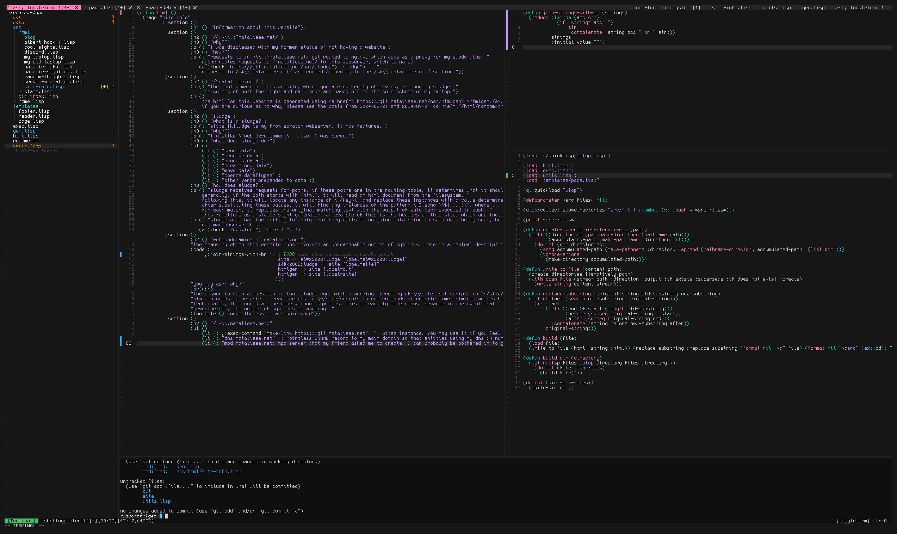

# n[at]vim 
its neovim configuration.

it does the things this thing needs it to and has a startup time between 25 and 50ms, which are the things it cares about.

it also looks reasonably good [[citation needed]](https://en.wikipedia.org/wiki/Wikipedia:Citation_needed).

the configuration is a bit of a mess. natalie will probably fix it at some point.
